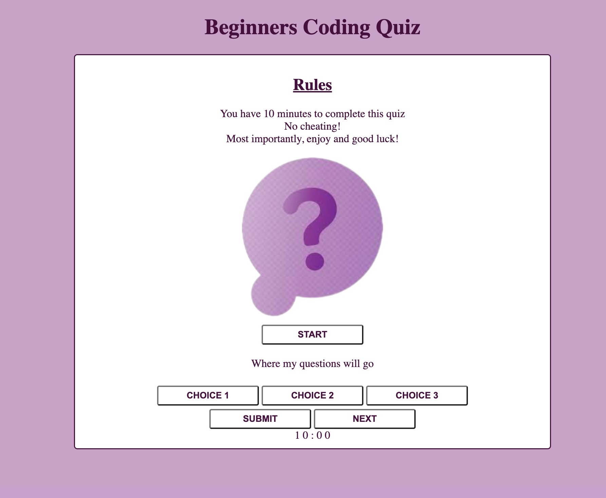

# MY CODING QUIZ

## I used HTML, CSS and JavaScript to build a coding quiz. I downloaded a quiz image from google to place in the middle of my quiz. 

[GitHub Link](https://github.com/NazKena/mycodingquiz)

[My Deployed Page](https://nazkena.github.io/mycodingquiz/)
